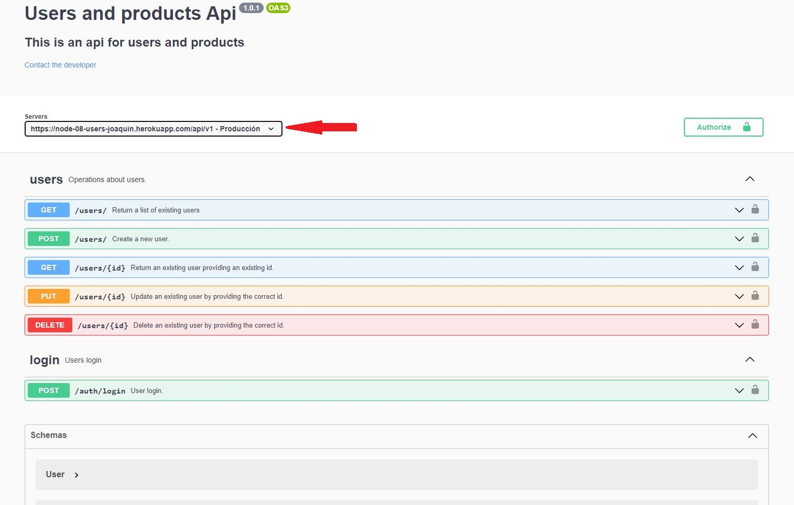
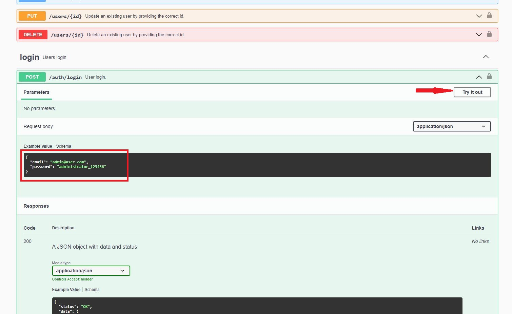
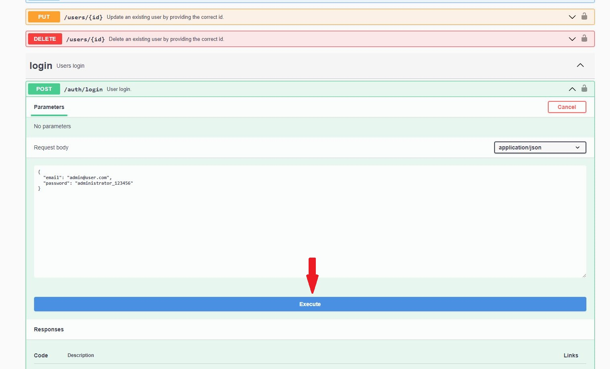
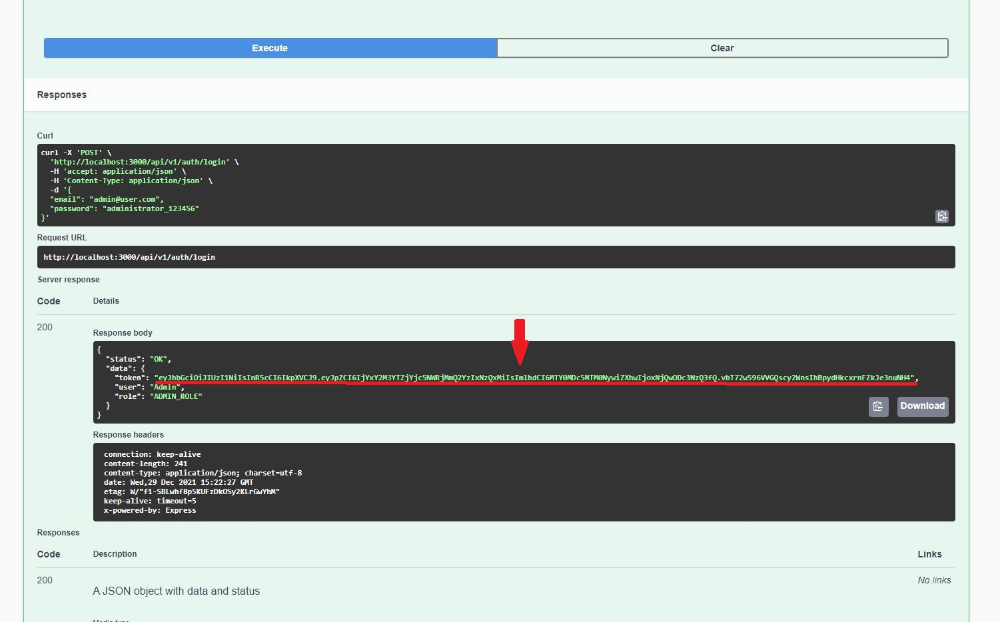
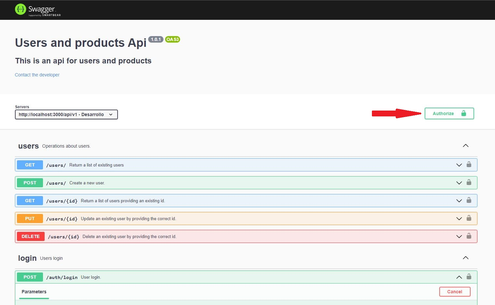
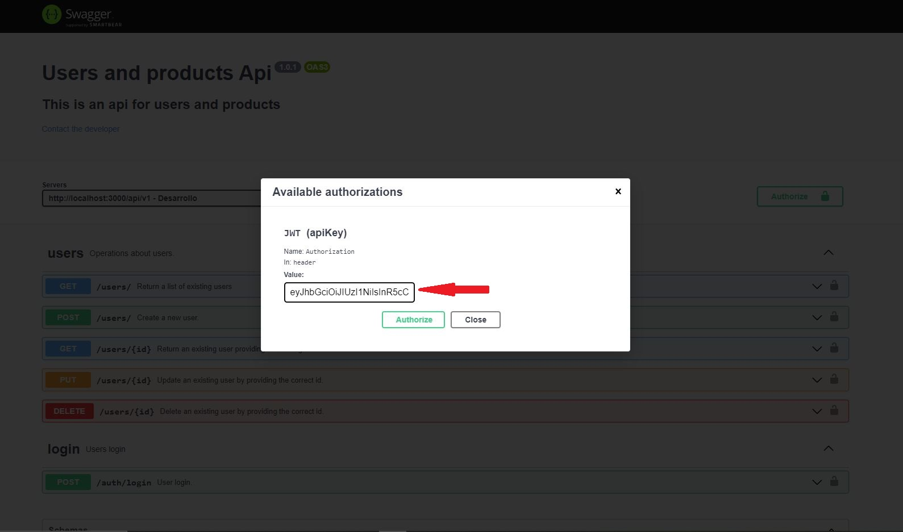

# node-08-user

API rest of users with CRUD and Login.

Includes:

* Code modularization
* Login with JWT Authentication
* Authorization
* Errors manipulation
* Loggers
* MongoDB cloud database
* Password Encryption
* Pagination
* Validations
* Swagger documentation
* Integration tests with Postman
* Automated tests reports in HTML using Newman
* Automated tests on commits with Husky
* Automated code formatting on git commits

## Tecnologies 🛠️

- Node.js
- Express
- Mongoose
- MongoDB
## Deployed version usage

1. Go to https://node-08-users-joaquin.herokuapp.com/documentation/

2. Select production server



2. Go to login and click "Try it out"



3. Execute the default example to receive a token.



4. Copy the Token within the response.



5. Click on Authorize.



6. Paste the Token.



7. Now you can perform the rest of the API calls.

## Local installation 🔧

1. Clone repository
    ```bash
    git clone
    ```
2. Install the proyect
    ```bash
    npm install
    ```
3. Create .env file and replace with the variables. (see env.example file)

4. Run
    ```bash
    npm run dev
    ```

